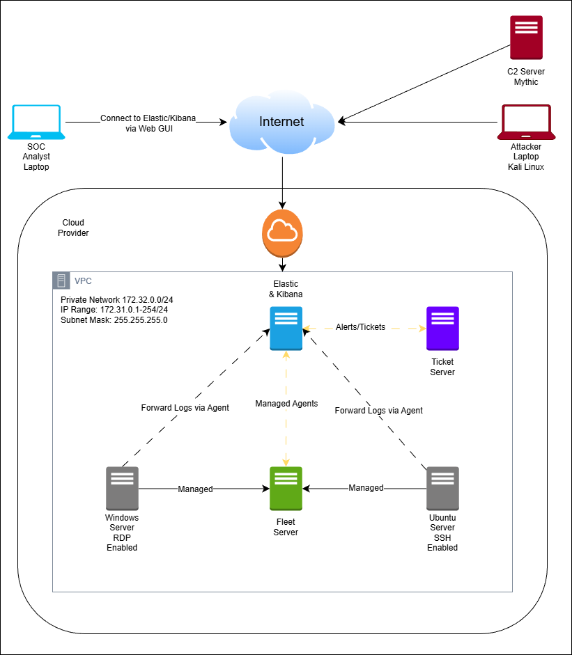

# SOC Homelab – Elastic SIEM with Fleet & Adversary Simulation

This repository documents my personal **SOC homelab** built to practice security monitoring, log ingestion, detection engineering, and alert investigation using the **Elastic Stack (Elastic SIEM)** with **Fleet-managed agents**.  
The lab also includes **adversary simulation** using Kali Linux and a C2 framework to generate realistic attack telemetry.

This project is intended to demonstrate practical SOC and blue-team skills for **internship and junior SOC roles**.

---

## 📌 Objectives
- Deploy Elastic Stack (Elasticsearch & Kibana) in a cloud-based VPC
- Centralize endpoint log collection using Elastic Agent + Fleet Server
- Monitor both Windows and Linux systems
- Simulate attacker activity using Kali Linux and C2 infrastructure
- Generate alerts and forward them to a ticketing system
- Practice SOC workflows: detection, triage, and investigation

---

## 🧱 Architecture Diagram

<p align="center">
  
</p>

---

## 🧠 Architecture Overview

**High-level flow:**
1. Windows and Linux endpoints run Elastic Agents
2. Agents are centrally managed via Fleet Server
3. Logs are forwarded to Elasticsearch
4. Detections and alerts are visualized in Kibana (Elastic SIEM)
5. Alerts are forwarded to a ticketing system
6. SOC Analyst accesses Kibana through a web interface
7. Attacker activity is simulated using Kali Linux and Mythic C2

---

## 🌐 Network Design
- **Cloud Provider:** AWS / Azure / GCP (homelab)
- **VPC CIDR:** 172.32.0.0/24
- **Subnet Mask:** 255.255.255.0
- **Private IP Range:** 172.32.0.1 – 172.32.0.254

---

## 🖥️ Components

### Elastic Stack
- **Elasticsearch** – Log storage and search
- **Kibana** – Dashboards, SIEM detections, investigations
- **Elastic SIEM** – Detection rules and alerting

### Fleet Server
- Centralized management of Elastic Agents
- Policy-based configuration and log collection

### Endpoints
- **Windows Server**
  - RDP enabled
  - Windows Event Logs
  - (Optional) Sysmon

- **Ubuntu Server**
  - SSH enabled
  - Auth logs and system logs

### Attacker Infrastructure
- **Kali Linux** attacker machine
- **Mythic C2** server
- Used to simulate:
  - SSH brute-force attacks
  - RDP login attempts
  - Command-and-control beaconing

### Ticketing System
- Alerts forwarded from Elastic SIEM
- Simulates SOC alert escalation workflow

---

## 📂 Repository Structure

```text
soc-homelab-elastic/
├── README.md
├── diagrams/
│   └── soc-homelab-architecture.png
├── setup/
│   ├── elastic-stack-setup.md
│   ├── fleet-server-setup.md
│   ├── windows-agent-install.md
│   └── ubuntu-agent-install.md
├── detection/
│   ├── detection-overview.md
│   ├── brute-force-detection.md
│   ├── c2-beaconing-detection.md
│   └── mitre-mapping.md
├── attack-simulation/
│   ├── kali-setup.md
│   ├── mythic-c2-setup.md
│   └── attack-scenarios.md
└── notes/
    ├── lessons-learned.md
    └── troubleshooting.md
```
    
## 🔍 Detection Focus (Initial)
- SSH brute-force attempts
- Windows RDP authentication failures
- Suspicious outbound connections (C2 beaconing)
- Abnormal authentication patterns

Detections are mapped to **MITRE ATT&CK** where applicable.

---

## 🚧 Project Status
- [x] Architecture design
- [ ] Elastic Stack deployment
- [ ] Fleet Server configuration
- [ ] Endpoint onboarding
- [ ] Attack simulation
- [ ] Detection rule creation
- [ ] Alert-to-ticket workflow

---

## 📖 Notes
This repository prioritizes **documentation and understanding** over automation.  
Configuration decisions, issues encountered, and lessons learned are intentionally recorded to reflect real SOC learning processes.

---

## ⚠️ Disclaimer
This lab is built for **educational purposes only**.  
All attacks are simulated in a controlled environment that I own.  
No real-world systems are targeted.
